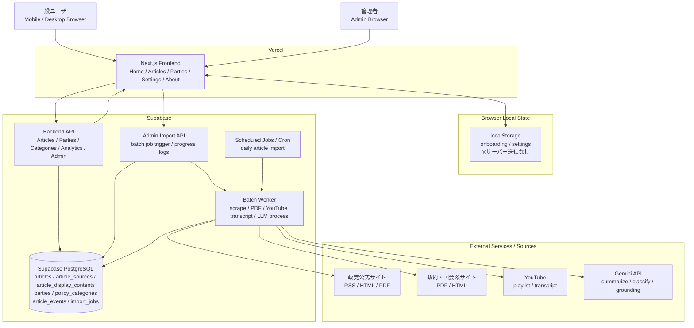

# システムアーキテクチャ

作成者：泉知成  
作成日：2026年4月30日  
更新日：2026年5月12日

## 結論

Kuni-Musubi は、初期段階では **Next.js + FastAPI 互換 Backend API + Python Batch + Supabase PostgreSQL** を基本構成とする。

本番ホスティングは、フロントエンドを **Vercel**、バックエンド API とバッチ処理、DB を **Supabase** に寄せる方針とする。

本プロダクトの中核は、画面上でリアルタイムに AI を動かすことではなく、政党公式サイトやニュース API から取得した情報を事前に解析・要約・分類し、ユーザーにとって読みやすい政治ニュースカードとして配信することにある。

そのため、フロントエンドは Next.js、バックエンド API は FastAPI 互換の API 層、データ収集・LLM 処理・記事表示コンテンツ生成などのバッチ処理は Python で実装する方針とする。

また、MVP ではログイン機能を設けず、初回利用時に選択した年代・支持政党・関心テーマなどをブラウザの localStorage に保存する。政治的嗜好はセンシティブな情報であるため、アカウントに紐づけず、ユーザーの心理的抵抗を下げることを優先する。

オンボーディングと設定画面の回答は localStorage のみに保存し、サーバーへ送信しない。ユーザーアカウント、記事保存、端末間同期は MVP でも将来構想でも前提にしない。サービス改善用には、記事表示・クリック・リアクションなどの記事単位の匿名イベントだけを扱う。

## 全体構成



### 配置方針

- **Vercel**: Next.js フロントエンドを配信する。ユーザー向け画面と管理画面 UI を担当する。
- **Supabase Backend API**: 記事一覧、記事詳細、政党、政策カテゴリ、記事イベント、管理画面向け API を担当する。
- **Supabase PostgreSQL**: 記事、出典、表示コンテンツ、政党、カテゴリ、匿名記事イベント、取り込みジョブ履歴を保存する。
- **Supabase Scheduled Jobs / Batch**: 政党公式サイト、国会 PDF、YouTube 字幕などを取得し、Gemini API で記事表示用コンテンツを生成して DB に保存する。
- **Browser localStorage**: オンボーディングと設定画面の回答を保存する。サーバーには送信しない。

現行実装の Backend は FastAPI、Batch は Python である。Supabase 上で運用する場合は、Supabase Edge Functions / Scheduled Jobs / 外部ジョブ実行基盤のどれで Python 実行を担保するかをデプロイ設計時に確定する。

## 技術スタック

### Frontend

- Next.js
- TypeScript
- Vercel
- PWA 対応を検討
- スマートフォンでの閲覧を最優先

Next.js は、タイムライン、記事詳細、オンボーディング、設定画面、政党一覧、管理画面、このアプリについて画面などの UI を担当する。Vercel から配信する。

初期段階ではネイティブアプリではなく Web/PWA として提供する。ユーザー検証後、必要に応じて React Native / Expo などでアプリ化を検討する。

### Backend API

- Python
- FastAPI
- Supabase

Backend API は、フロントエンドに対して記事・政党・政策カテゴリ・記事イベント API を返す API を担当する。管理画面からの記事取り込みジョブ実行、単一 URL 取り込み、URL リスト取り込み、ジョブログ表示も担当する。

Kuni-Musubi はスクレイピング、自然言語処理、LLM による分類・要約など Python と相性の良い処理が多いため、バックエンドも Python に寄せる。

### Batch Workers

- Python
- Supabase Scheduled Jobs / Cron
- 管理画面からの手動実行

バッチ処理では、政党公式サイトのスクレイピング、ニュース API の取得、LLM による要約・分類、記事カード・記事詳細用の表示コンテンツ生成を行う。

本番運用で処理量が増えた場合は、Celery + Redis などのジョブキュー導入を検討する。

### Database

- PostgreSQL
- Supabase PostgreSQL

PostgreSQL には、記事、出典、政党、政策カテゴリ、記事カード・記事詳細用の表示コンテンツ、匿名の記事イベント集計などを保存する。オンボーディングと設定画面の回答は localStorage にのみ保存し、サーバーには送信しない。

ユーザーアカウントは作成しないため、ユーザーテーブルは設けない。記事保存や端末間同期も実装しない。

## MVP でログインを設けない理由

Kuni-Musubi の初期利用時には、年代、支持政党、関心テーマなどを入力する可能性がある。これらはユーザーにとってセンシティブな情報を含むため、アカウント登録と紐づくと心理的抵抗が大きい。

また、本プロダクトの主ペルソナは政治に苦手意識や不信感を持つ若手社会人である。初回利用時にログインや会員登録を求めると、体験のハードルが上がり、離脱につながる可能性が高い。

したがって、MVP では以下の方針を採用する。

- ログイン不要
- 初回オンボーディングのみ実施
- 支持政党なし / わからないを自然な選択肢として用意
- 設定は localStorage に保存
- 設定画面でいつでも変更可能にする
- オンボーディングと設定画面の回答はサーバーに送信しない
- 記事への反応など、記事単位の匿名イベントだけを改善用に保存する
- 記事保存、端末間同期、個人別プロフィールは作らない

## localStorage に保存する設定

クッキーではなく localStorage を基本とする。

クッキーはリクエストごとにサーバーへ送信されるため、政治的嗜好を保存する場所としては慎重に扱う必要がある。一方で localStorage はブラウザ内に保存され、明示的に送信しない限りサーバーへ渡らない。

MVP では以下のような設定を localStorage に保存する。

```ts
type UserPreference = {
  ageGroup: string | null;
  selectedPartyId: string | null;
  interestCategoryIds: string[];
  completedOnboarding: boolean;
};
```

保存キーの例:

```txt
kuni-musubi.preferences
```

## オンボーディング

初回利用時に、以下を選択してもらう。

- 支持政党
- 支持政党なし
- わからない
- 関心テーマ

設定画面では、localStorage の内容を書き換えることで、いつでも設定を変更できるようにする。

オンボーディングと設定画面の回答は、表示内容の調整に使うため端末内の localStorage に保存する。サーバーには送信しない。

## API 設計方針

フロントエンドは localStorage の設定を読み取り、記事取得時に必要な条件だけ API に渡す。

例:

```txt
GET /articles?party=none&categories=economy,tax,welfare
```

MVP で想定する API:

- `GET /articles`
- `GET /articles/{article_id}`
- `GET /parties`
- `GET /parties/{party_id}`
- `GET /policy-categories`
- `POST /analytics/article-event`

分析系 API は、個人識別ではなく記事単位の改善用集計を目的とする。オンボーディング回答はサーバーに送信しない。

MVP では推薦専用 API は作らない。ホーム画面の記事表示は、`GET /articles` の政党・カテゴリ絞り込みと新着順/重要順の並び替えで対応する。

## 記事カードのデータ構造

ユーザーに表示する記事は、元記事をそのまま表示するのではなく、事前に整形された記事カードとして配信する。

```ts
type ArticleCard = {
  id: string;
  displayTitle: string;
  cardSummary: string;
  partyId: string | null;
  partyShortName: string | null;
  categories: string[];
  thumbnailType: "none" | "text" | "manual_image" | "category_default";
  thumbnailText: string | null;
  thumbnailUrl: string | null;
  publishedAt: string;
};
```

重要なのは、ポジティブな情報だけで完結させないことである。政党広報やプロパガンダに見えるリスクを下げるため、記事カードには最低限以下を含める。

- ポジティブなタイトル
- 100文字程度の要約
- 政党タグ
- カテゴリタグ
- 日付
- 必要に応じたテキストベースサムネイル

記事詳細画面では、以下を表示する。

- 何が良いニュースなのか
- 我々の生活への影響
- 残る課題
- 世論・与野党からの評価
- 出典・一次情報リンク

## LLM 利用方針

LLM は、ユーザーのリクエストごとに実行しない。

バッチ処理で事前に以下を生成し、DB に保存する。

- 記事要約
- ポジティブ判定
- 課題解決型ニュースかどうかの判定
- 政策カテゴリ付け
- 生活への影響
- 残る課題
- 世論・与野党からの評価

この方針により、以下を実現する。

- レスポンス速度を安定させる
- API コストを抑える
- 表示内容をキャッシュできる
- 生成結果を事前確認しやすくする

これは、ニュース API 調査で整理した Zero-Runtime-LLM の方針と一致する。

## MVP の記事表示方針

MVP では、高度な推薦アルゴリズムは重要視しない。

まずは以下の単純な表示制御にとどめる。

- 選択した政党の記事を先頭に表示する。
- 関心カテゴリに一致する記事を優先する。
- 各政党タブで政党別の記事を表示する。
- 必要に応じて、新着順・重要順で並べる。

推薦専用のロジックやユーザー単位の推薦ログは MVP では作らない。

## 初期画面

MVP で作るべき画面は以下。

- オンボーディング
  - 支持政党なし / わからないを選べる
  - 関心テーマを選択できる
  - スキップを選べる

- ホームタイムライン
  - ポジティブかつ建設的な政治ニュースカードを表示する

- 記事詳細
  - 何が良いニュースなのか
  - 我々の生活への影響
  - 残る課題
  - 世論・与野党からの評価
  - 出典・一次情報リンク

- 政党一覧
  - 各政党の基本理念・主要政策を平易に表示する

- 設定画面
  - localStorage の設定を書き換える
  - 年代、支持政党、関心テーマを変更できる

- このアプリについて画面
  - プロダクトの意図、データの扱い、特定政党の宣伝ではないことを表示する

記事保存機能は MVP では実装しない。ログインや保存機能を前提にせず、閲覧体験と情報設計の検証を優先する。

## DB の主要テーブル案

MVP で想定する主要テーブル:

```txt
parties
articles
article_sources
article_display_contents
policy_categories
article_parties
article_categories
scraping_runs
llm_processing_runs
article_events
daily_article_stats
daily_category_stats
```

匿名集計用テーブルの役割:

```txt
article_events
- 記事表示、記事クリック、記事詳細閲覧、参考になったクリックなどを匿名イベントとして保存する。

daily_article_stats
- 記事ごとの表示回数、クリック数、詳細閲覧数、参考になったクリック数を日次集計する。

daily_category_stats
- 政策カテゴリごとの表示回数、クリック数、詳細閲覧数、参考になったクリック数を日次集計する。
```

採用しないテーブル:

```txt
users
user_profiles
user_interests
saved_articles
user_article_events
recommendation_logs
```

ユーザー単位の長期追跡や、政治思想と閲覧履歴を個人別に結合する設計は採用しない。

## 将来拡張

MVP 後に検討する拡張:

- 通知
- 匿名の記事イベント分析
- 記事・タグ単位の集計ダッシュボード
- 表示制御・並び替えロジックの改善
- React Native / Expo によるアプリ化
- Celery + Redis などのジョブキュー導入
- 管理画面による記事カードの確認・修正
- ファクトチェックや監修フローの追加

ログイン、端末間同期、記事保存は現時点では将来拡張にも含めない。Kuni-Musubi は、ユーザーアカウントを持たない匿名ニュースアプリとして設計する。

## 重要な設計原則

1. ユーザーに政治的嗜好の入力を強制しない。
2. 「支持政党なし」「わからない」を自然な選択肢として扱う。
3. 政治的嗜好をアカウントに紐づけない。
4. ログイン、記事保存、端末間同期は実装しない。
5. localStorage は個人の表示設定、DB は匿名集計データとして役割を分ける。
6. 年代、支持政党、関心テーマは匿名集計イベントとして扱う。
7. 政治思想と閲覧履歴を個人単位で結合しない。
8. LLM は表示時ではなく事前処理で使う。
9. 一次情報と出典リンクを必ず保持する。
10. ポジティブな情報だけでなく、残る課題も表示する。
11. MVP では高度な推薦よりも、記事カード・記事詳細の情報設計を優先する。
12. UI は短く、軽く、政治に不慣れな人でも読める設計にする。
13. 将来の拡張よりも、まずは心理的ハードルの低い体験を優先する。
